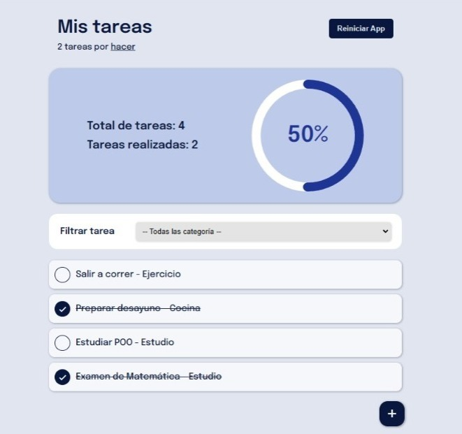

# ADMINISTRAR-TAREAS
Esta aplicación fue pensada para ayudar a las personas a que puedan llevar un control sobre sus tareas, en esta se puede registrar, editar, actualizar y eliminar las tareas, tiene un modal dinámico que contiene la información de la tarea seleccionada, también un filtro para que se pueda hacer una búsqueda más rápida sobre las tareas a elaborar, además de un gráfico para dar a conocer su proceso actual con respecto a las tareas completadas. 

technologies = React / Javascript / chart.js / SweetAlert2 / CSS

URL = https://administrar-tareas.netlify.app/
